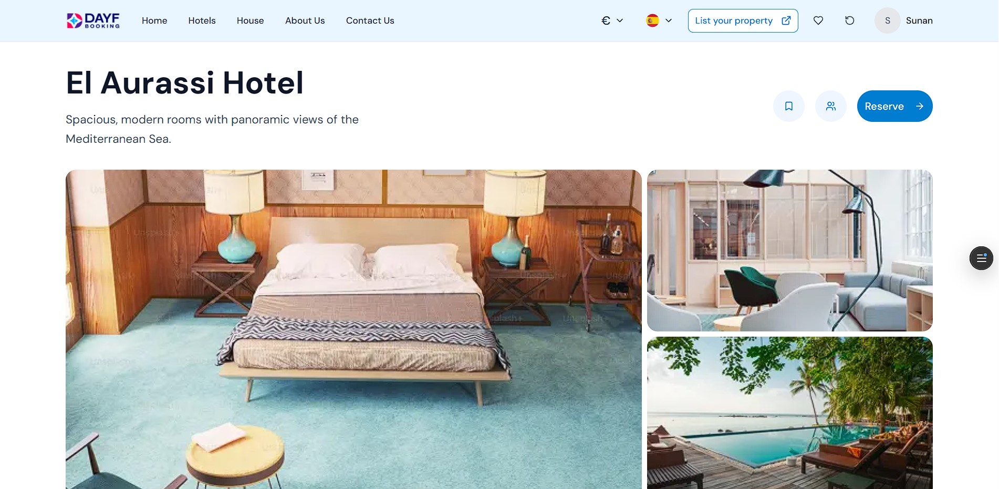

# 🚀 SparkTech Assessment



[Live Demo](https://sparktech-assessment.vercel.app/)

A modern Next.js TypeScript application powered by ShadCN UI and Tailwind CSS, deployed on Vercel.

---

## Table of Contents

- [About](#about)  
- [Tech Stack](#tech-stack)  
- [Features](#features)  
- [Getting Started](#getting-started)  
  - [Prerequisites](#prerequisites)  
  - [Installation](#installation)  
  - [Development](#development)  
  - [Production Build](#production-build)  
  - [Deployment](#deployment)  
- [Project Structure](#project-structure)  
- [Contributing](#contributing)  
- [License](#license)  

---

## About

This project is the assessment deliverable for SparkTech. It showcases a sleek, responsive interface built with **Next.js**, utilizing **TypeScript** for type safety, **ShadCN UI** for component architecture, and **Tailwind CSS** for styling. The application is live at the link above and deployed on Vercel.

---

## Tech Stack

- **Frontend:** Next.js (App Router)
- **Language:** TypeScript  
- **UI Library:** ShadCN UI  
- **Styling:** Tailwind CSS  
- **Deployment:** Vercel  

---

## Features

- 🧩 Modular ShadCN UI components  
- 🎨 Tailwind-powered utility-first styling  
- ⚡ Blazing fast refresh and SSR  
- 📱 Fully responsive  
- 🌍 Internationalization-ready  
- 🚀 Deployed seamlessly with Vercel  

---

## Getting Started

### Prerequisites

- Node.js v16+  
- npm or Yarn  

### Installation

```bash
git clone https://github.com/Joyeta-Mondal/Sparktech-Agency-assessment.git
cd Sparktech-Agency-assessment
npm install
